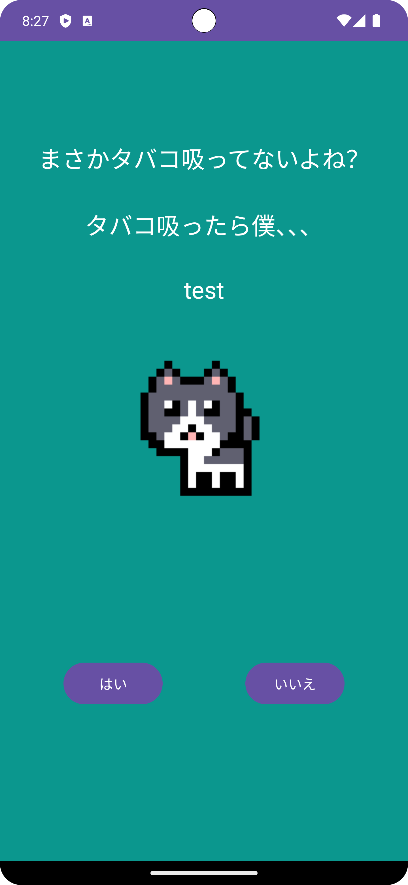
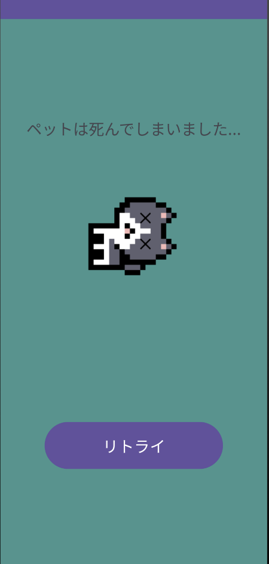

# banapp

【技育CAMP】マンスリーハッカソン vol.13参加作品

「育成ゲーム」 + 「禁煙」を組み合わせたアプリケーションです。
バックエンドはPythonとMySQLで実装しています  
-> https://github.com/onodaseiya/banapp-backend
## Skills

## Member

* [kametsun](https://github.com/kametsun)
* [baki](https://github.com/HarukiKubota-56)
* [onodaseiya](https://github.com/onodaseiya)
* [IkedaKe1](https://github.com/IkedaKe1)
* [satoimo](https://github.com/satoimo7106)
